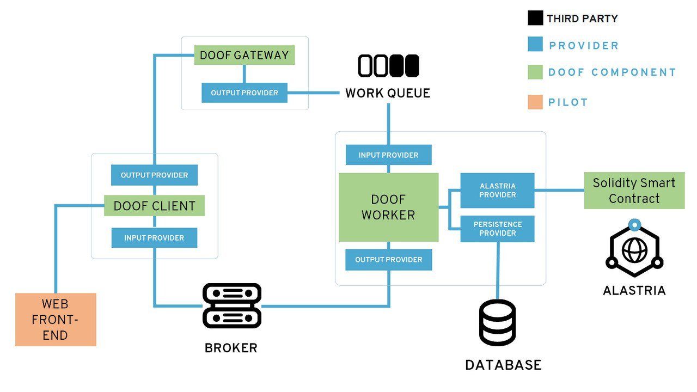

# DOOF
DOOF (Data Ownership Orchestration Framework) is a groundbreaking project aimed at revolutionizing personal data governance and establishing the groundwork for a resilient data economy. At its core, DOOF introduces a versatile framework that promotes the development of privacy-enhancing technologies, ensuring compliance with the General Data Protection Regulation (GDPR) and Data Act, thus, enabling individuals to control their data rights effectively. The mission of DOOF is to foster trust and transparency in the digital ecosystem by providing individuals with the tools to manage their personal data easily and securely. By streamlining the deployment of user-friendly, GDPR-compliant data exchanges across various sectors, DOOF offers a practical solution for data management challenges. 

DOOF's key components include a set of software development kits (SDKs), libraries, and smart contracts. Additionally, the project features a smart-home device configuration tool and a web-based data exchange platform, which streamline complex data management for users, enhancing their engagement and facilitating adoption. One of DOOF's primary advantages is its adaptability and scalability. The project leverages APIs for swift integration into existing software ecosystems, ensuring efficient, sector-wide deployment while optimizing cost-effective system integration. With DOOF, we are laying the foundation for a resilient and transparent data economy where individuals have greater control over their data, fostering trust, regulatory compliance, and ultimately, a more user-centric and secure digital landscape.

# PROJECT OBJECTIVES AND CORE FUNCTIONALITIES 
Consent Management ; decentralized ; disintermediate connection between Data Owners and Data Users/Recipients 
Representation of data origins 

Consent Management:
data streams, data sets 
Subscribe 
Grant 
Revoke 

Actual sharing of data and enforcement of decisions : done by selected PET, can be DVCO or other technology that controls access of data users/recipients to data based on data owners' decisions 

# PROJECT DELIVERABLES

This repository contains the DOOF components developed withing the NGI Trustchain project. The following picture depicts the architecture of DOOF. 

The DOOF components (in green) and the third-party components (black) that are used for the communication between them are:
-	The DOOF Client: an HTTPS client application that consumes the services offered by DOOF back-end. It can be integrated into applications used by end-users.
-	DOOF Gateway: an HTTPS Gateway which facilitates the integration and communication between clients (front-end) and worker (back-end), by exposing RESTful APIs.
-	Work Queue: A third-party message queuing system that holds all the tasks to be processed by the first available Worker. The usage of a Work Queue allows the implementation of a competing consumers pattern, which delivers high availability and horizontal scalability as it allows to distribute the overall workload over a set of Worker Processes, local or remote. An example of a message queueing system that can be used is an AMQP broker such as RabbitMQ.
-	DOOF Worker: this is the most important component within the DOOF, as it delivers the core functionality of orchestrating different services for achieving Data Ownership, including the connection with the Intermediation Platform, i.e. a blockchain such as Alastria. The DOOF Worker processes all the tasks (available from the Work Queue) that were fed by the DOOF Gateway, based on the requests from the DOOF Client.
-	Broker: A third-party pub-sub broker that is used by the Worker to send asynchronous notifications to the DOOF Client. Typically, the asynchronous notifications originated by the Worker hold the results of the processing triggered by the requests sent by the DOOF Clients. A communication based on pub-sub broker is needed as the Intermediation Platform may expose non-deterministic latencies. A pub-sub broker may implement mqtt protocol, and be e.g. EMQX. The DOOF Client subscribes to a topic of this pub-sub broker which is specific for the client’s session, in order to receive the asynchronous notifications. The DOOF worker publishes notifications on the topic specific to the client’s session.
-	Solidity Smart Contract: The smart contract on the intermediation platform has the responsibility to maintain the relationships between Data Owners and Data Users and the list of consents that the data owner has granted to data users. The intermediation platform can be implemented in several different ways, depending on the desired degree of decentralization. For instance, the intermediation platform can be based on DLT technologies (in particular: Alastria) or on more traditional technologies like RDBMS. In case of a blockchain platform is used, the relationships between Data Owners and Data Users are maintained thanks to a set of Smart Contracts developed by Ecosteer.
- Database: A persistence layer used to keep an off-chain representation and additional details regarding the objects found in the smart contract, for user and session management, and for any other extension that may be required by a given use case.  

The web front-end component (in orange) is an instance of the DOOF client that uses some of the functionalities exposed by the client's APIs. It is a component developed for the piloting phase of the DOOF, for the creation of a Web Data Exchange, which demonstrated of the capabilities and functionalities of DOOF. This exchange is made available to selected Data Owners in order to manage the visibility over their assets,i.e. their data generated by devices under their control. The description of the devices and their usage in the pilot is given in the section PILOT.

# REPOSITORY STRUCTURE

The repository structure is organized in such a way to map the folders to the different elements of the architecture. The repository contains the following folders: 

- common: collects modules shared between multiple classes in the project, and between the different components 

- components: contains the different components of the Data Ownership Orchestration Framework in specific subfolders: DOOF Clients, DOOF Gateway, DOOF worker, intermediation (smart contract)

- provider: contains the different providers (modules) that can be loaded at run time by the different components. The input and output providers represented in the architecture schemas are found under the 'presentation' subfolder, the persistence provider that communicates with a database is found under the 'persistence' subfolder and the provider that communicates with the intermediation platform/smart contract is found under 'intermediation' subfolder. Moreover, the 'processors' subfolder contains the processors that populate the worker's pipeline and allow to deliver the business logic functionality of consent management and facilitation of deployment of Privacy Enhancing Technologies.

The following sections will present each of the components into greater detail. 

## DOOF Worker
The DOOF Worker is the main component of the ecosystem. It implements an Orchestration Framework tailored with Data Ownership capabilities, thanks to the usage of a specific business logic implemented as plug-in through resource managers, providers and pipelines of processors. 

## DOOF Client

## DOOF Gateway 

## Smart Contract
TODO insert image that summarizes the structure of the smart contract

# PILOT 
Data Exchange
DOOF functionalities used for consent management
Integration into Smart Home devices (Qubees) and deployment of a PET, the Ecosteer-properietary Data Visibility Control Overlay (DVCO)
